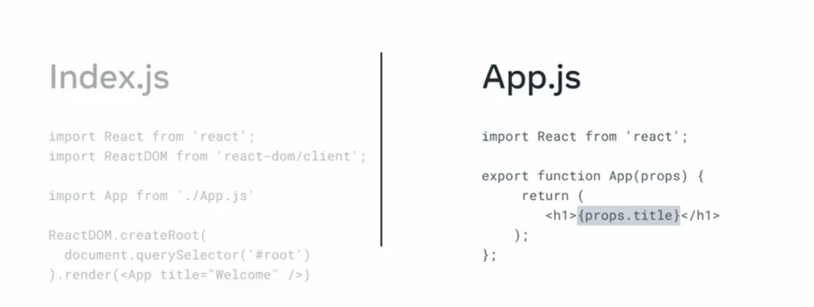

Props (properties) são o equivalente a parâmetros em funções JS

Props são usados para passar dados de um componente para outro usando sintaxe de atributos HTML

Quando os componentes se comunicam para passar os dados, o componente que fornece dados é conhecido como Parent (Pai) e o que recebe é conhecido como Child (filho)

Alguma limitações são que a comunicação é unidirecional (então o Child não pode enviar props de volta para o Parent) e uma propriedade (prop) não pode alterar props de outras funções